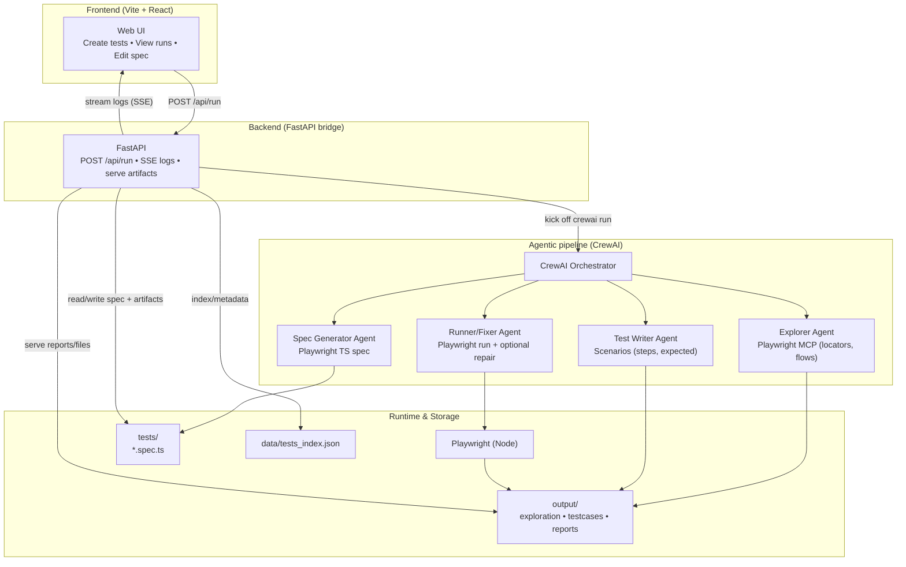
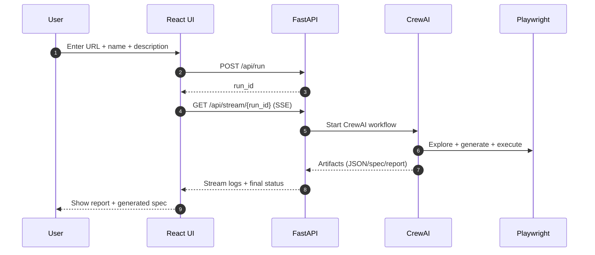
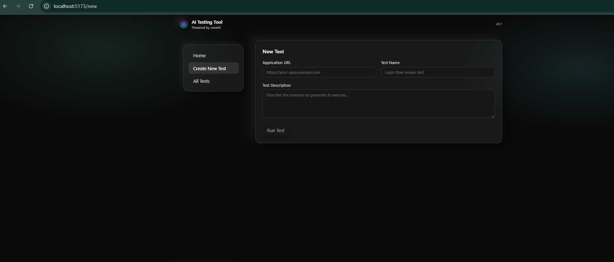
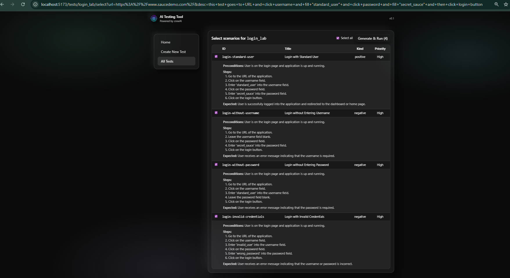
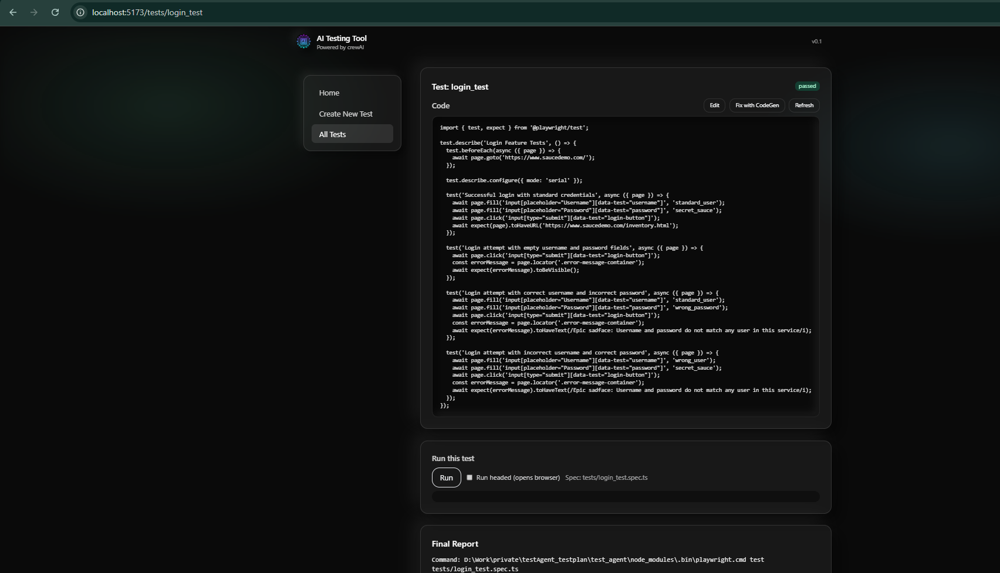
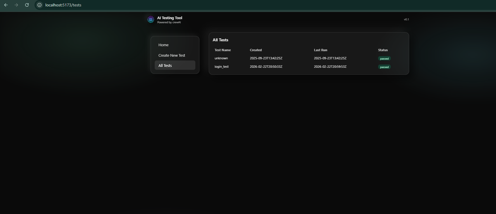

# AI TestAgent — Agentic Playwright Test Generation 

Agentic Playwright test generation, execution, and repair with a simple web UI.

This repository combines:
- **CrewAI multi-agent workflow** (Python) to explore an app, draft test cases, generate Playwright scripts, run them, and (optionally) auto-fix failures.
- **FastAPI backend** that bridges the CrewAI run + Playwright execution and streams logs to the UI via **SSE**.
- **Vite + React UI** for creating tests, viewing runs, editing generated specs, selecting scenarios, and re-running tests.

---

## Project goal

Turn a short natural-language requirement like:
> “Test login with valid/invalid credentials and verify error messages.”

into:
1) a **structured UI exploration dataset** (selectors, roles, flows),
2) **QA-style test scenarios** (steps + expected results),
3) a **Playwright TypeScript spec** file, and
4) a **run report** (pass/fail, fixes applied, artifacts/logs).

---

## Current use case

- You provide **Application URL**, **Test Name**, and **Test Description**.
- The agents explore the UI (via Playwright MCP), create test scenarios, generate a Playwright spec, run it, and produce a final report.
- The UI lets you:
  - browse generated tests,
  - view and edit the `.spec.ts`,
  - run a single spec or run multiple selected scenarios.

---

## Workflow

### CrewAI pipeline (sequential)
1. **App Explorer**
   - Navigates the web app using Playwright MCP.
   - Produces `output/exploration_data.json` with best selectors (prefer `getByRole`, `getByLabel`, `getByTestId`).

2. **Post-Processor**
   - Cleans outputs (removes triple-backticks and extra text).

3. **Test Case Writer**
   - Converts exploration + description into structured scenarios JSON.
   - Saves to `output/Testcases/<test_name>_test_cases.json`.

4. **Script Generator**
   - Produces `tests/<test_name>.spec.ts` strictly from the exploration selectors.

5. **Test Executor / Debugger**
   - Runs Playwright tests.
   - If failures occur, attempts targeted fixes and re-runs.
   - Writes `output/final_report.md`.

### UI + API flow
- UI calls `POST /api/run` to trigger the full pipeline.
- UI subscribes to `GET /api/stream/{run_id}` (Server-Sent Events) for live logs.
- Artifacts are served from `/outputs/...`.

---

## System design

### High-level architecture



### Run sequence (what happens when you click **Run**)



### Key pieces (where to look)

- **FastAPI server** (`backend/server`): starts runs, streams logs via SSE, and serves `output/` artifacts.
- **CrewAI agents** (`src/test_agent/`): exploration, test-case writing, spec generation, and execution/fix.
- **Playwright runtime** (Node): executes the generated `.spec.ts` and produces reports/artifacts.

## Outputs

Generated/updated during a run:

- `output/exploration_data.json`
  - UI elements and best selectors extracted from the app.

- `output/Testcases/<test_name>_test_cases.json`
  - JSON scenarios with steps + expected results.

- `tests/<test_name>.spec.ts`
  - Runnable Playwright test spec generated from the scenarios.

- `output/final_report.md`
  - Full run report including:
    - original script,
    - fix attempts + errors,
    - final pass/fail.

- `output/reports/<test>-<timestamp>.md` and `output/reports/<test>-playwright-<timestamp>.txt`
  - Archived reports for each run.

---

## Utility

- **QA acceleration**: quickly draft test plans and automation scripts.
- **Selector correctness**: avoids guessing selectors by relying on exploration output.
- **Repair loop**: reruns and fixes common brittleness without rewriting everything.
- **Traceability**: reports keep an audit trail of what changed and why.

---

## How to run

### Prerequisites
- **Docker Desktop** running 
- **Python 3.11**
- **Node.js + npm**
- **Playwright browsers** (installed via the repo setup script)

### Configure environment
Create `.env` in repo root:

```env
OPENAI_API_KEY=your_key
MODEL=gpt-4o

```
### Install dependencies

#### Python (CrewAI)
Using `uv` (recommended):

```bash
pip install uv
uv sync
```
Or, if you’re using CrewAI’s installer:

```bash
pip install crewai
crewai install
```


### Windows 

```powershell
# 1) Start Docker Desktop first

# 2) Create + activate venv
py -3.11 -m venv .venv
. .\.venv\Scripts\Activate.ps1

# 3) Python deps for the FastAPI bridge + agents
pip install -r backend/requirements.txt

# 4) Node deps (root + frontend) + Playwright browser install
npm run setup

# 5) Start Backend (FastAPI)
npm run dev:backend

# 6) Start Frontend (new terminal)
npm run dev:frontend
```

### macOS / Linux (equivalent)


```bash
## start docker 
sudo systemctl start docker

python3.11 -m venv .venv
source .venv/bin/activate

pip install -r backend/requirements.txt

npm run setup

# Backend
npm run dev:backend
# Frontend (another terminal)
npm run dev:frontend
```

Open the Vite URL (typically `http://localhost:5173`).

### Run from CLI (optional)

```bash
# Run the CrewAI pipeline without the UI
crewai run
```

## API endpoints (backend)

Most used endpoints:

- `POST /api/run`
  - Body: `{ application_url, test_name, test_description }`
  - Starts CrewAI pipeline.

- `GET /api/stream/{run_id}`
  - SSE stream of logs until `{ status: "finished" }`.

- `GET /api/tests`
  - Lists known tests from `data/tests_index.json`.

- `GET /api/tests/{name}`
  - Returns test metadata, current spec source, last report.

- `PUT /api/tests/{name}`
  - Saves updated spec code.

- `POST /api/run-test`
  - Runs an existing spec via Playwright.

- `POST /api/tests/{name}/codegen`
  - Launches Playwright `codegen` and writes into `tests/{name}.spec.ts`.

- `GET /outputs/{file_path}`
  - Serves output artifacts.

---

## App screenshots


### New Test


### Test Plan


### Test Detail


### All Tests



---

## Future scope

- **Model/router upgrades**: support multiple providers and per-agent model selection.
- **Better artifacts**: attach Playwright trace/video/screenshots automatically to reports.
- **Scenario management**: save scenario sets, tag them, and allow merging/splitting suites.
- **Authentication helpers**: reusable login fixtures and storage-state management.
- **CI integration**: GitHub Actions workflow to run generated specs nightly.
- **Safer execution sandbox**: containerize the Playwright run environment.
- **Prompt hardening**: stricter schema validation for JSON outputs and fallback parsing.

---

## Repository layout

```text
test_agent/
├─ backend/
│  └─ server.py                 # FastAPI bridge + SSE + Playwright helpers
├─ data/
│  └─ tests_index.json          # Test metadata (created_at, last_run_at, report links)
├─ frontend/                    # Vite + React + TS UI
│  ├─ public/
│  └─ src/
│     ├─ components/
│     ├─ layouts/
│     ├─ pages/
│     └─ lib/api.ts             # backend API client
├─ output/
│  ├─ exploration_data.json
│  ├─ final_report.md
│  ├─ reports/                  # archived run reports
│  └─ Testcases/                # per-test scenario JSON
├─ src/
│  └─ test_agent/
│     ├─ config/
│     │  ├─ agents.yaml         # agent roles + goals
│     │  └─ tasks.yaml          # pipeline tasks + output files
│     ├─ tools/
│     │  └─ custom_tool.py      # Playwright runner + output cleaner
│     ├─ crew.py                # CrewAI orchestration
│     └─ main.py                # CLI entrypoint
├─ tests/                       # generated Playwright specs
├─ playwright.config.ts
├─ pyproject.toml
└─ package.json
```

---

## Notes and troubleshooting

- If Playwright CLI isn’t found, run:
  - `npm install` and `npx playwright install chromium`
- On Linux without a desktop session, Playwright `codegen` may require `xvfb-run`.
- If you only want planning (exploration + scenarios) without script generation/execution, set:

```bash
export FAST_PLAN_ONLY=1
```

---

